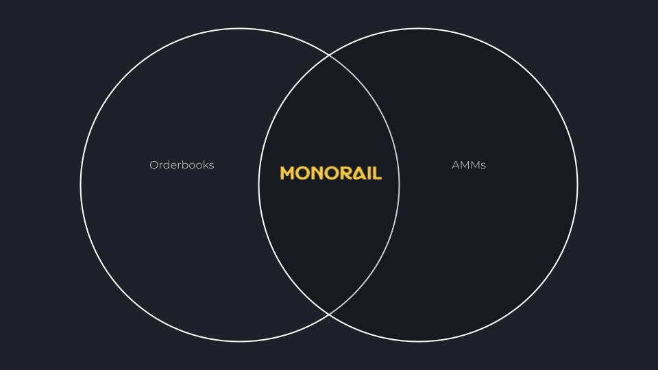

# Welcome to Monorail

Monorail introduces an advancement in DeFi aggregation by unifying AMMs and orderbooks into a single, mathematically coherent liquidity framework. This is known as our Synthetic Orderbooks.

/// caption
Without Monorail, orderbooks and AMMs will stay isolated
///

## Key Features of our Synthetic Orderbooks

- Unified AMM and orderbook liquidity aggregation
- Optimal routing with reduced slippage
- Lower gas costs through efficient execution
- Dynamic slippage protection
- Protocol-agnostic framework

## Getting Started

Start with our [introduction](introduction.md) to understand how Monorail transforms the aggregation landscape.
