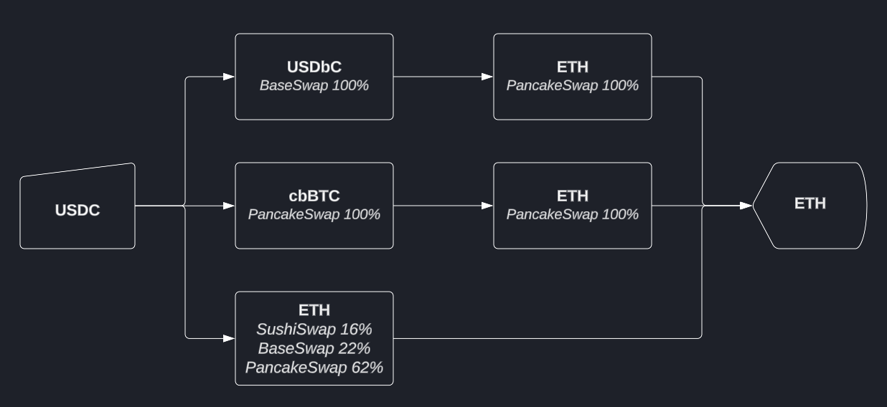
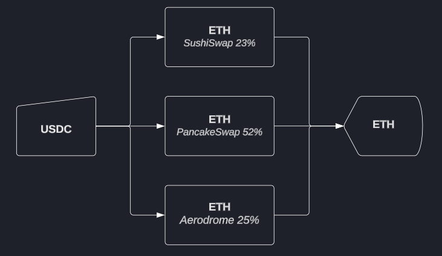

# Performance

!!! note "Notice"

    This is the first draft of the performance section. It will be updated as we progress through the development and refining the model

## Optimization Approach

Monorail takes a fundamentally different approach to routing compared to traditional aggregators:

- Analyzes complete liquidity landscape mathematically
- Finds optimal execution path
- Minimizes unnecessary trade splits
- Reduces gas costs and fees

## Real-World Comparison

Consider this real-life comparison with a leading aggregator:

### Other aggregator Route (5 swaps)

{width="500"}
/// caption
Other aggregator route
///

- Input: 5,000 USDC
- Output: 1.52732 ETH
- Complexity: 5 separate swaps
- Multiple token hops

### Monorail Route (3 swaps)

{width="500"}
/// caption
Monorail route
///

- Input: 5,000 USDC
- Output: 1.52769 ETH
- Improvement: +0.00037 ETH
- Reduced complexity: Only 3 swaps
- Lower gas requirements
- Reduced fees

### Future Potential

This example focused purely on AMM aggregation. Greater performance advantages are expected once Monad's on-chain orderbooks launch and attract liquidity.
