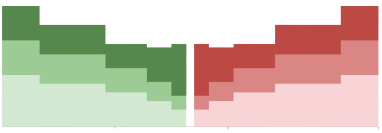

# Orderbook Integration

## Mapping Order Depth to Price Levels

Orderbooks naturally provide liquidity in a discretized format through their limit order structure. This is compatible with our liquidity model and thus require no further transformation.

### Integration Process

For each trading pair, Monorail:

1. Extracts the relevant side of the orderbook (buy or sell)
2. Maps liquidity directly into our unified model
3. Preserves the precise price discovery mechanism

## Aggregating Total Liquidity

Once orderbook depth is mapped, Monorail combines it with our previously decomposed AMM liquidity. At each price level, we aggregate the total available liquidity from both market structures into a single value.

{ width="500" }
/// caption
Aggregated Liquidity
///

### Benefits

- Creates a full view of all executable liquidity across the market
- Enables optimal routing decisions
- Maintains venue-specific advantages
- Simplifies complex liquidity landscapes
